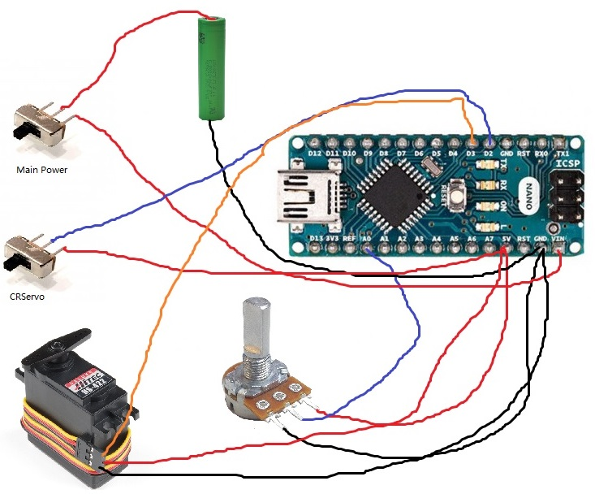

# Darbots-Servo-Tester
Open-Source Hardware Servo-Tester Project powered by Darbots.   

## 1.0 Why this project?
In FTC Software development, the idea of Unit Testing is a concept that a lot of teams emphasize about. However, due to the complex nature of using FTC control systems (pairing of phones, compilation of opmodes, wiring components to Rev Expansion Hubs / Control Hubs), unit testing is extremely time-consuming.   
Thus, Darbots inititated this project to help FTC teams as well as ourselves speed up unit testing processes. This project is only for unit-testing for servos.   

## 2.0 How do I make this project myself.   
First of all, you need the following components.   

- 1 &times; potentiometer, preferably with Resistence >= 10K.
- 2 &times; slide SPDT switches. You need to cut one of the two noncommon pins.
- 1 &times; Arduino Nano 3.0 (Either ATMEGA168 or ATMEGA328 is good)
- 1 &times; Servo Female to Male / Female to Female Wire, you will need to cut it to make a port on the tester.

Then you wire all the components accordingly to the diagram below   

Finally, connect your Arduino Nano with a USB Micro-B wire.   
You need to arrange the components to make them look aligned and professional, you can design a cardbox container for them, if you like.   